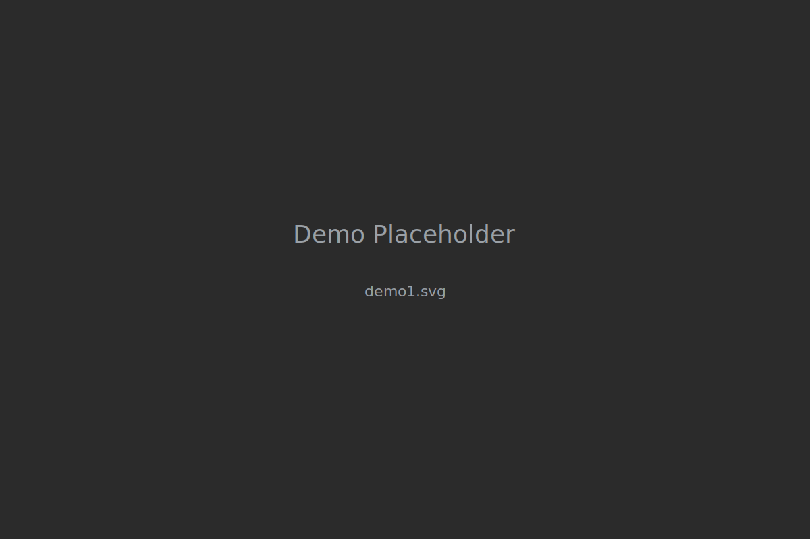
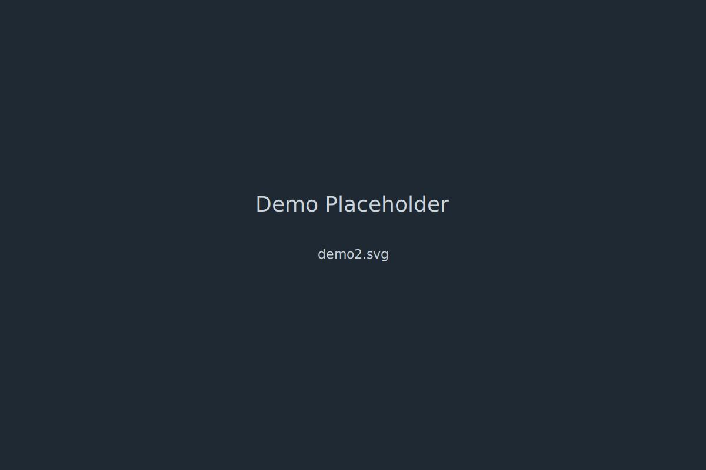

# Valo Spectator Ghost — Valorant Tactical Coach

<a href="https://your-live-demo.example" target="_blank" rel="noopener">Live Demo — Valo Spectator Ghost</a>

A compact, professor-ready demo and teaching project: a Valorant-themed "Spectator Ghost" that offers tactical advice, commentary, and playstyle suggestions.

## 🎯 Three Ways to Start

<table>
<tr>
<td width="33%" align="center">
<h3>🏃‍♂️ Just Get It Running</h3>

<strong>5-minute setup</strong>

<a href="docs/GETTING_STARTED.md">Quick Start Guide →</a>
  
<em>Setup, run tests, see it work</em>
</td>
<td width="33%" align="center">
<h3>📚 Teach Me Properly</h3>

<strong>Full learning path</strong>

<a href="docs/LEARNING_PATH.md">Learning Path Map →</a>
  
<em>Follow the guided journey</em>
</td>
<td width="33%" align="center">
<h3>🎯 I Know What I'm Doing</h3>

<strong>Jump to the code</strong>

<a href="src/">Browse Source →</a>
  
<em>See patterns, apply them</em>
</td>
</tr>
</table>

---

## 📖 Your Learning Resources

### 🎓 Course Materials
- **[Learning Path Map](docs/LEARNING_PATH.md)** - Master roadmap
- **[Getting Started](docs/GETTING_STARTED.md)** - Setup and first steps
- **[Course Structure](docs/COURSE_STRUCTURE.md)** - 2-week session plan
- **[Code as Textbook](docs/CODE_AS_TEXTBOOK.md)** - How to read this code
- **[Student Guide](docs/STUDENT_GUIDE.md)** - Day-by-day checklist
- **[Grading Rubric](docs/GRADING.md)** - What you'll be evaluated on

### 🛠️ Development Guides
- **[TDD Workflow](docs/TDD_WORKFLOW.md)** - Write tests first (15 min read)
- **[AI Collaboration](docs/AI_COLLABORATION.md)** - Work with Claude (10 min read)
- **[Git Workflow](docs/GIT_WORKFLOW.md)** - Professional commits (10 min read)
- **[Logging Guide](docs/LOGGING.md)** - Enterprise logging (5 min read)
- **[Labs (Guided Practice)](docs/LEARNING_PATH.md#2-narrative-reading-days-12)** - Hands-on exercises per chapter

### 💡 Project Resources
- **[Project Launch Kit](docs/PROJECT_LAUNCH_KIT.md)** - Scope and planning template
- **[Project Ideas](docs/PROJECT_IDEAS.md)** - 60+ ideas with difficulty ratings
## Valo Spectator Ghost — AI Coaching Demo

A compact, professor-ready demo that adapts an educational template into a Valorant-themed "Spectator Ghost": an AI assistant that gives tactical commentary and playstyle tips.

Quick facts
-----------
- Language: Python 3.11+ (developed on Python 3.12)
- Web UI: Flask demo at `/spectator-ghost` (served by `app.py`)
- Tests: pytest test suite (69 tests, local run)

Getting started (developer)
---------------------------
1. Create and activate a virtualenv:

    python -m venv venv
    source venv/bin/activate

2. Install dependencies:

    pip install -r requirements.txt

3. Add your OpenAI API key locally (DO NOT commit this file):

    # copy the example and edit, then add your key
    cp .env.example .env
    # then edit .env and set OPENAI_API_KEY

4. Run tests:

    pytest -q

5. Run the Flask demo:

    python app.py

    Open: http://localhost:5000/spectator-ghost

What to include for professor submission
---------------------------------------
- Ensure `.env` is listed in `.gitignore` and not committed.
- All tests should pass on CI (we recommend Python 3.11 in the Actions matrix).
- Provide a short demo video or screenshots showing `/spectator-ghost` in action.

Demo / Screenshots
------------------
Below are example screenshots of the demo UI. Replace these with real screenshots from your run when you have them.

Important files
---------------
- `app.py` — Flask demo (routes and frontend wiring)
- `src/` — core logic (search service, client wrapper, parser, models)
- `templates/` & `static/` — demo UI files (spectator_ghost page)
- `tests/` — pytest tests covering the codebase
- `AI_IMAGE_PROMPTS.md` — prompts used for generating concept art

Next recommended tasks
----------------------
1. Replace remaining template strings in `docs/` (I can do this safely, skipping `venv/`).
2. Add a GitHub Actions workflow to run tests & lint on Python 3.11.
3. (Optional) Run black/isort and add format/lint checks to CI.

If you'd like, I can proceed with the above tasks now — tell me whether to (A) rewrite README only, (B) also perform safe search-and-replace in `docs/`, or (C) add CI next.

License
-------
See LICENSE or contact the repository owner.
