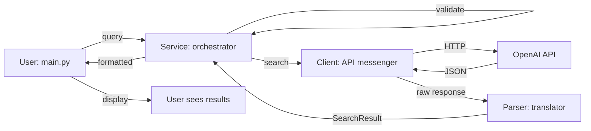

# 📖 Enterprise AI Development: A Code Textbook

> **Learn professional software development by reading code like a story**

[]()
[]()
[]()
[]()

---

## 🎯 Course Overview: 2-Week Project-Based Learning

<table>
<tr>
<td width="33%">
<h3>🎨 What You'll Build</h3>
A creative application using <strong>OpenAI's APIs</strong> that solves a real problem
</td>
<td width="33%">
<h3>🛠️ What You'll Learn</h3>
Professional practices: <strong>TDD • Clean Architecture • AI Collaboration • Enterprise Logging • CI/CD</strong>
</td>
<td width="33%">
<h3>📚 What Makes This Unique</h3>
<strong>Code written as a narrative textbook.</strong> Each file is a chapter teaching concepts through story.
</td>
</tr>
</table>

**Learning Outcome:** Build confidence to create, test, and demonstrate production-quality software.

---

## 🚀 Three Ways to Begin Your Learning Journey

<table>
<tr>
<th>🏃‍♂️ I Want to Start Coding NOW</th>
<th>📚 I Want to Learn by Reading First</th>
<th>🎓 I Learn Best by Exploring</th>
</tr>
<tr>
<td valign="top">

**5-Minute Setup:**
```bash
# Clone and setup
git clone [repo-url]
cd valo_project_1
python -m venv venv
source venv/bin/activate

# Install and configure
pip install -r requirements.txt
cp .env.example .env
# Edit .env: add OPENAI_API_KEY

# Verify it works
pytest
python -m src.main "AI news"
```

✅ **Working?** → Jump to [Week 1 Session 1](#week-1-session-1-understanding-the-architecture)

</td>
<td valign="top">

**Start Your Textbook:**

1. **[📖 Code as Textbook Guide](docs/CODE_AS_TEXTBOOK.md)** ← **START HERE**
   - Choose your learning path
   - Understand the chapter structure
   - See reading time estimates

2. **Read chapters in order:**
   - Chapter 1: Data Models
   - Chapter 2: API Client
   - Chapter 3: Parser
   - *(Continue through 12 chapters)*

**Time:** 4-6 hours deep learning

</td>
<td valign="top">

**Explore the Code:**

1. Open [Architecture Map](#-architecture-the-story-structure) below
2. Click files in sequence:
   - [`src/models.py`](src/models.py) - See the data
   - [`src/client.py`](src/client.py) - API communication
   - [`src/main.py`](src/main.py) - User interface
3. Read the narrative comments
4. Run examples in Python REPL
5. Check tests to verify understanding

**Style:** Jump around, connect dots

</td>
</tr>
</table>

---

## 📖 The "Code as Textbook" Philosophy

### What This Means

**Traditional Code:**
```python
@dataclass
class SearchOptions:
    """Configuration options."""
    model: str = "gpt-4o-mini"
```

**Our Textbook Code:**
```python
# ============================================================================
# BLUEPRINT 1: SearchOptions - Configuring the Search
# ============================================================================

@dataclass
class SearchOptions:
    """
    Configuration options for web search requests.
    
    📚 CONCEPT: Dataclasses
    -----------------------
    The @dataclass decorator is Python's way of saying "this is just data."
    It automatically generates __init__, __repr__, and __eq__ methods.
    
    Think of it like filling out a form:
    - model: Which AI model to use (like choosing your search engine)
    - allowed_domains: Only search these websites (site:example.com)
    
    📝 DESIGN DECISION: Default Values
    ----------------------------------
    If you don't specify a model, it defaults to "gpt-4o-mini" 
    (fastest, cheapest for learning).
    
    EXAMPLE USAGE:
    >>> options = SearchOptions(model="gpt-4o", reasoning_effort="high")
    """
    model: str = "gpt-4o-mini"  # Which AI model processes the search
```

### What You Get

Every file includes:
- **📖 Story Context** - Why this code exists in the bigger picture
- **💡 Learning Objectives** - What concepts you'll master
- **🎯 Design Decisions** - Why we chose this approach (and alternatives)
- **📝 Real-World Analogies** - Complex concepts explained through everyday examples
- **✨ Runnable Examples** - Code you can copy-paste and try immediately
- **🔗 Cross-References** - "See Chapter 3 for how this connects..."

### Learning Paths Available

Based on your experience, choose your path:

| Path | Best For | Start Chapter | Duration |
|------|----------|---------------|----------|
| **"I'm New to Python"** | Beginners learning syntax | Chapter 1 (Models) | 6-8 hours |
| **"Teach Me Architecture"** | Intermediate devs | Chapter 4 (Service) | 4-5 hours |
| **"Master Testing"** | Anyone wanting TDD mastery | Chapter 7 (Test Foundation) | 3-4 hours |
| **"Full Story"** | Complete understanding | Chapter 1 → 12 | 6-8 hours |

📘 **[View Full Learning Path Guide →](docs/CODE_AS_TEXTBOOK.md)**

---

## 🗺️ Architecture: The Story Structure

### The Application Flow



### File Organization (Reading Order)

```
📖 THE TEXTBOOK CHAPTERS
├── 📂 src/ - The Story (Production Code)
│   ├── 📄 models.py          ← Chapter 1: Foundation (Data Blueprints)
│   │                            Learn: dataclasses, type hints, exceptions
│   ├── 📄 client.py          ← Chapter 2: Messenger (API Communication)
│   │                            Learn: API clients, error handling, secrets
│   ├── 📄 parser.py          ← Chapter 3: Translator (Data Transformation)
│   │                            Learn: JSON parsing, defensive coding
│   ├── 📄 search_service.py  ← Chapter 4: Orchestrator (Business Logic)
│   │                            Learn: service layer, validation, composition
│   ├── 📄 main.py            ← Chapter 5: Interface (User Interaction)
│   │                            Learn: CLI design, argparse, UX
│   └── 📄 logging_config.py  ← Chapter 6: Observer (Enterprise Logging)
│                                Learn: structured logs, rotation, performance
├── 📂 tests/ - The Proof (Test Code)
│   ├── 📄 conftest.py        ← Chapter 7: Test Foundation (Fixtures)
│   ├── 📄 test_models.py     ← Chapter 8: Testing Data (Unit Tests)
│   ├── 📄 test_client.py     ← Chapter 9: Testing APIs (Mocking)
│   ├── 📄 test_parser.py     ← Chapter 10: Testing Transforms
│   ├── 📄 test_search_service.py ← Chapter 11: Testing Integration
│   └── 📄 test_main.py       ← Chapter 12: Testing System (End-to-End)
│
└── 📂 docs/ - The Guidebooks
    ├── 📘 CODE_AS_TEXTBOOK.md        ← YOUR STARTING POINT
    ├── 📗 STUDENT_GUIDE.md           ← 2-week roadmap
    ├── 📙 AI_COLLABORATION.md        ← Working with Claude
    ├── 📕 TDD_WORKFLOW.md            ← Test-driven development
    ├── 📓 GIT_WORKFLOW.md            ← Professional commits
    ├── 📔 LOGGING.md                 ← Enterprise logging
    ├── 📖 PROJECT_IDEAS.md           ← 60+ project ideas
    └── 📜 openai_tools_research_oct2025.md ← All OpenAI APIs (1300 lines!)
```

**Reading Time Estimates:**
- 📄 Source files: ~20-30 min each (with experimentation)
- 📗 Guide docs: ~5-15 min each
- 📖 Full textbook: 4-6 hours (life-changing experience)

---

## 🎓 Your Learning Journey: 2 Weeks to Mastery

### Week 1: Understanding by Reading & Exploration

#### **Session 1 (90 min): Understanding the Architecture**
**Learning Objective:** See how professional applications are structured

```bash
# 1. Setup (15 min)
- Clone repository
- Setup virtual environment
- Run tests and application
- Verify everything works

# 2. Read the Textbook (45 min)
- 📘 CODE_AS_TEXTBOOK.md - Choose your learning path
- 📄 src/models.py - Read Chapter 1 completely
- 📄 src/client.py - Read Chapter 2 completely
- Run examples as you read

# 3. Hands-On Exploration (30 min)
- Open Python REPL
- Import and experiment with SearchOptions
- Try creating different configurations
- Break things intentionally, see what happens
```

**Homework:** 
- Read Chapters 3-4 (parser.py, search_service.py)
- Choose your project idea from [PROJECT_IDEAS.md](docs/PROJECT_IDEAS.md)
- Read [OpenAI Tools Research](docs/openai_tools_research_oct2025.md) for your chosen APIs

#### **Session 2 (90 min): Understanding Tests & TDD**
**Learning Objective:** Learn how tests document and validate behavior

```bash
# 1. Study the Test Chapters (40 min)
- 📄 tests/conftest.py - Chapter 7: See test fixtures
- 📄 tests/test_models.py - Chapter 8: Simple unit tests
- 📄 tests/test_client.py - Chapter 9: Mocking external APIs

# 2. Practice TDD (40 min)
- Read TDD_WORKFLOW.md
- Write a test for new SearchOptions field
- Watch it fail (RED)
- Implement the feature (GREEN)
- Run full test suite

# 3. Project Planning (10 min)
- Sketch your project architecture
- List 5 core features
- Write first user story
```

**Homework:**
- Read [AI_COLLABORATION.md](docs/AI_COLLABORATION.md)
- Setup Claude in VS Code
- Start drafting your project README

### Week 2: Building Your Project

#### **Session 3 (90 min): Start Building with TDD**
**Learning Objective:** Apply patterns from textbook to your project

```bash
# 1. Project Initialization (20 min)
- Create new repository
- Copy structure from reference
- Setup CI/CD workflow
- First commit

# 2. Build Core Models (50 min)
- Define your data models (like Chapter 1)
- Write tests first (TDD)
- Implement models
- Run tests, iterate

# 3. Code Review (20 min)
- Review with instructor/peer
- Compare to reference implementation
- Refactor based on feedback
```

**Homework:**
- Build your API client (Chapter 2 pattern)
- Write comprehensive tests
- Make atomic git commits

#### **Session 4 (90 min): Complete & Polish**
**Learning Objective:** Finish features and prepare for demo

```bash
# 1. Feature Completion (50 min)
- Finish service layer
- Complete main interface
- Add error handling
- Achieve >80% coverage

# 2. Documentation & Polish (30 min)
- Write clear README
- Add usage examples
- Clean up code
- Final testing

# 3. Demo Preparation (10 min)
- Prepare 5-minute presentation
- Practice live demo
- Prepare for questions
```

**Homework:**
- Practice your demo
- Review your code narrative
- Prepare to explain one technical decision

### Week 3: Demo Day 🎤

**Your 5-Minute Presentation:**
1. **Problem & Solution** (1 min) - What does your app do and why?
2. **Live Demo** (2 min) - Show it working
3. **Technical Deep Dive** (1.5 min) - Explain one interesting challenge
4. **Q&A** (0.5 min) - Answer questions

**Evaluation Criteria:** See [Grading Rubric](#-grading-rubric) below

---

## 🎯 What This Reference Implementation Demonstrates

### This Web Search Tool: A Teaching Example

This repository contains a **production-quality web search application** that demonstrates every concept you'll need:

**What It Does:**
```bash
$ python -m src.main "latest quantum computing breakthroughs"

🔍 Searching for: latest quantum computing breakthroughs

📝 AI Summary:
Recent breakthroughs in quantum computing include achieving quantum
advantage in optimization problems and developing error-correction codes...

📚 Sources:
[1] Nature Journal - Quantum Supremacy Achieved
    https://nature.com/articles/quantum2025
[2] MIT News - Error Correction Breakthrough
    https://news.mit.edu/quantum-correction-2025
```

**Why It's Educational:**

1. **Real-World Application** - Not a toy example
2. **Complete Test Coverage** - 69 tests, 100% coverage
3. **Enterprise Patterns** - Logging, error handling, CI/CD
4. **Clean Architecture** - Separation of concerns
5. **Narrative Comments** - Learn by reading

**Technical Features You'll Study:**

| Feature | What You Learn | Where to Find It |
|---------|----------------|------------------|
| **Dataclasses** | Modern Python data modeling | `src/models.py` lines 1-150 |
| **API Client Pattern** | External service integration | `src/client.py` lines 1-200 |
| **JSON Parsing** | Safe data transformation | `src/parser.py` lines 1-150 |
| **Service Layer** | Business logic organization | `src/search_service.py` |
| **CLI Design** | User interface best practices | `src/main.py` |
| **Enterprise Logging** | Production monitoring | `src/logging_config.py` |
| **Test Fixtures** | Reusable test data | `tests/conftest.py` |
| **Mocking** | Testing without external deps | `tests/test_client.py` |
| **TDD Workflow** | Red-Green-Refactor cycle | All test files |
| **CI/CD** | Automated quality gates | `.github/workflows/ci.yml` |

### Meta-Learning: Tool Building Tool

**Inception Moment:** We used this web search tool to research OpenAI's APIs and create the [comprehensive API documentation](docs/openai_tools_research_oct2025.md) you'll reference. 

This demonstrates:
- **Practical value** - Build tools you actually use
- **Learning acceleration** - Use AI to learn faster
- **Professional practice** - Real developers build tools to solve their own problems

**Your Turn:** Build something equally useful that solves a problem YOU have.

---

## 🛠️ OpenAI Tools Available (October 2025)

**Full Research Document:** [openai_tools_research_oct2025.md](docs/openai_tools_research_oct2025.md) (1,315 lines)

### Quick Reference Table

| API | What It Does | Difficulty | Example Project |
|-----|--------------|------------|-----------------|
| **Chat Completion** | Conversational AI, text generation | ⭐ Beginner | Personal AI tutor |
| **Vision** | Image analysis, OCR | ⭐⭐ Intermediate | Recipe from food photo |
| **DALL-E 3** | Image generation | ⭐ Beginner | AI art studio |
| **Whisper** | Speech-to-text | ⭐⭐ Intermediate | Meeting transcriber |
| **TTS** | Text-to-speech | ⭐ Beginner | Audiobook generator |
| **Embeddings** | Semantic search | ⭐⭐⭐ Advanced | Document Q&A system |
| **Assistants API** | Persistent AI agents | ⭐⭐⭐ Advanced | Research assistant |
| **GPT-5 Pro** | Advanced reasoning | ⭐⭐ Intermediate | Complex problem solver |
| **Sora 2** | Video generation | ⭐⭐⭐ Advanced | Story-to-video creator |
| **AgentKit** | Multi-agent workflows | ⭐⭐⭐ Advanced | Collaborative AI team |

**💡 Pro Tip:** Start with 1-2 APIs. Master them completely rather than superficially using many.

**Need Ideas?** Browse [60+ project ideas with difficulty ratings →](docs/PROJECT_IDEAS.md)

---

## 📚 Complete Documentation Library

### 📘 Core Learning Materials

| Document | Purpose | Read When | Time |
|----------|---------|-----------|------|
| **[CODE_AS_TEXTBOOK.md](docs/CODE_AS_TEXTBOOK.md)** | Your main learning guide | **START HERE** | 20 min |
| **[STUDENT_GUIDE.md](docs/STUDENT_GUIDE.md)** | 2-week session roadmap | Day 1 | 10 min |
| **[PROJECT_IDEAS.md](docs/PROJECT_IDEAS.md)** | 60+ project suggestions | When choosing project | 15 min |

### 📗 Development Practices

| Document | Purpose | Read When | Time |
|----------|---------|-----------|------|
| **[TDD_WORKFLOW.md](docs/TDD_WORKFLOW.md)** | Test-driven development | Before coding | 15 min |
| **[AI_COLLABORATION.md](docs/AI_COLLABORATION.md)** | Working with Claude | Before using AI | 10 min |
| **[GIT_WORKFLOW.md](docs/GIT_WORKFLOW.md)** | Professional commits | Before first commit | 10 min |
| **[LOGGING.md](docs/LOGGING.md)** | Enterprise logging | When adding logs | 5 min |

### 📖 Reference Materials

| Document | Purpose | Use As | Size |
|----------|---------|--------|------|
| **[openai_tools_research_oct2025.md](docs/openai_tools_research_oct2025.md)** | All OpenAI APIs documented | Reference while coding | 1,315 lines |

### 📂 Archived Materials

Historical documentation moved to `docs/archive/` - useful for additional context but not required reading.

---

## 🎨 Grading Rubric (100 Points)

### Functionality (30 points)
- **Works without crashes** (10 pts)
- **Core features complete** (10 pts)
- **Uses OpenAI APIs correctly** (10 pts)

### Code Quality (30 points)
- **Test coverage >80%** (10 pts)
- **Clean architecture** (separation of concerns) (10 pts)
- **Error handling & validation** (10 pts)

### Professional Practices (25 points)
- **TDD workflow** (tests written first) (10 pts)
- **Conventional git commits** (5 pts)
- **Logging implemented** (5 pts)
- **CI/CD pipeline** (5 pts)

### Documentation & Demo (15 points)
- **Clear README** with setup instructions (5 pts)
- **Code comments** explaining decisions (5 pts)
- **Effective 5-min demo** (5 pts)

### Grade Boundaries

| Grade | Points | Characteristics |
|-------|--------|-----------------|
| **A** | 90-100 | Full TDD, >90% coverage, enterprise patterns, creative project, polished demo |
| **B** | 80-89 | Solid TDD, >80% coverage, good practices, working project, good demo |
| **C** | 70-79 | Some tests, basic features, works, acceptable demo |
| **D** | 60-69 | Minimal tests, incomplete features, many bugs |
| **F** | <60 | Doesn't work, no tests, missing core requirements |

**Bonus Points (+5):** Exceptional creativity, going beyond requirements, helping classmates

---

## 🆘 Getting Help: Your Support System

### During Class Sessions
1. **Ask your instructor** - No question is too basic
2. **Pair with classmates** - Two minds > one
3. **Use Claude in VS Code** - Your AI coding partner

### Outside Class Hours

#### 1. **Read the Textbook**
The code itself is documentation. Stuck on something?
- Open the relevant chapter in `src/`
- Read the narrative comments
- Try the examples
- Check related test file

#### 2. **Consult the Guides**
```bash
# Forgot TDD workflow?
cat docs/TDD_WORKFLOW.md

# Need git help?
cat docs/GIT_WORKFLOW.md

# API questions?
grep "embeddings" docs/openai_tools_research_oct2025.md
```

#### 3. **Use Claude Effectively**
Ask specific questions with context:

**❌ Bad:** "My code doesn't work"

**✅ Good:**
```
I'm building a recipe generator using Vision API. I'm trying to 
extract ingredients from a food photo. Here's my code:

[paste relevant code]

I'm getting this error: [paste error]

What's wrong and how do I fix it?
```

See [AI_COLLABORATION.md](docs/AI_COLLABORATION.md) for more tips.

#### 4. **Common Issues & Solutions**

| Problem | Solution |
|---------|----------|
| **Tests failing?** | `pytest -v` to see details, read test names for clues |
| **Import errors?** | Activate virtual environment: `source venv/bin/activate` |
| **API key not working?** | Check `.env` file, verify key starts with `sk-` |
| **Coverage not 100%?** | `pytest --cov=src --cov-report=term-missing` shows gaps |
| **Git confused?** | `git status` then `git log --oneline` to see state |
| **Claude giving bad advice?** | Ask "Why?" and verify against reference code |

#### 5. **Debugging Workflow**

```bash
# 1. Reproduce the error
python -m src.main "test query"

# 2. Check logs
tail logs/app.log

# 3. Run specific test
pytest tests/test_client.py::TestWebSearchClient::test_search_with_basic_query -v

# 4. Use Python debugger
python -m pdb src/main.py

# 5. Ask for help with specifics
```

---

## 💻 Development Commands Reference

### Essential Commands

```bash
# Virtual Environment
python -m venv venv                    # Create venv
source venv/bin/activate               # Activate (Mac/Linux)
venv\Scripts\activate                  # Activate (Windows)
deactivate                             # Deactivate

# Testing
pytest                                 # Run all tests
pytest -v                              # Verbose output
pytest tests/test_client.py            # Run specific file
pytest -k "test_search"                # Run tests matching pattern
pytest --cov=src                       # Run with coverage
pytest --cov=src --cov-report=html     # HTML coverage report

# Code Quality
pylint src/                            # Lint source code
pylint tests/                          # Lint tests

# Running the Application
python -m src.main "query"             # Basic search
python -m src.main "query" --verbose   # Verbose logging
python -m src.main "query" --model gpt-4o  # Specific model

# Git Workflow
git status                             # Check status
git add .                              # Stage changes
git commit -m "feat: add feature"      # Commit (conventional format)
git log --oneline                      # View history
git push origin main                   # Push to remote
```

### Advanced Commands

```bash
# Coverage with missing lines
pytest --cov=src --cov-report=term-missing

# Run tests in parallel (faster)
pytest -n auto

# Watch mode (re-run on file changes)
ptw -- --cov=src

# Profile test performance
pytest --durations=10

# Generate coverage badge
coverage-badge -o coverage.svg -f
```

---

## 🏗️ Project Structure Explained

### Why This Architecture?

```
enterprise_ai_demo1_websearch/
│
├── 📂 src/                          # Production code (the application)
│   ├── __init__.py                  # Makes src a package
│   ├── models.py                    # 📖 Ch 1: Data definitions
│   ├── client.py                    # 📖 Ch 2: API communication
│   ├── parser.py                    # 📖 Ch 3: Response transformation
│   ├── search_service.py            # 📖 Ch 4: Business logic
│   ├── main.py                      # 📖 Ch 5: User interface
│   └── logging_config.py            # 📖 Ch 6: Logging setup
│
├── 📂 tests/                        # Test code (the proof)
│   ├── conftest.py                  # 📖 Ch 7: Shared fixtures
│   ├── test_models.py               # 📖 Ch 8: Model tests
│   ├── test_client.py               # 📖 Ch 9: Client tests
│   ├── test_parser.py               # 📖 Ch 10: Parser tests
│   ├── test_search_service.py       # 📖 Ch 11: Service tests
│   ├── test_main.py                 # 📖 Ch 12: Integration tests
│   └── fixtures/                    # Test data files
│       └── sample_responses.json
│
├── 📂 docs/                         # Documentation
│   ├── CODE_AS_TEXTBOOK.md          # 📘 Main learning guide
│   ├── STUDENT_GUIDE.md             # 📗 2-week roadmap
│   ├── AI_COLLABORATION.md          # 📙 Claude tips
│   ├── TDD_WORKFLOW.md              # 📕 TDD guide
│   ├── GIT_WORKFLOW.md              # 📓 Git practices
│   ├── LOGGING.md                   # 📔 Logging guide
│   ├── PROJECT_IDEAS.md             # 📖 Project inspiration
│   ├── openai_tools_research_oct2025.md  # 📜 API reference
│   └── archive/                     # Historical docs
│
├── 📂 .github/workflows/            # CI/CD automation
│   └── ci.yml                       # GitHub Actions config
│
├── 📂 logs/                         # Generated log files
│   ├── app.log                      # Application logs
│   └── error.log                    # Error logs only
│
├── 📄 .env.example                  # Template for environment variables
├── 📄 .env                          # Your secrets (git-ignored)
├── 📄 .gitignore                    # Files to ignore
├── 📄 .pylintrc                     # Linting configuration
├── 📄 .coveragerc                   # Coverage configuration
├── 📄 pytest.ini                    # Pytest configuration
├── 📄 requirements.txt              # Python dependencies
└── 📄 README.md                     # This file!
```

### Design Principles Demonstrated

1. **Separation of Concerns**
   - Models = data structure
   - Client = communication
   - Parser = transformation
   - Service = orchestration
   - Main = presentation

2. **Dependency Flow**
   ```
   main.py → service → client → OpenAI
                    ↓
                  parser → models
   ```

3. **Test Coverage**
   - Every source file has corresponding test file
   - `conftest.py` provides shared fixtures
   - Tests mirror source structure

4. **Documentation**
   - Code comments explain "why"
   - Docs provide context and guidance
   - Tests show usage examples

---

## 🎓 Learning Outcomes: What You'll Master

By completing this course, you will be able to:

### Technical Skills

✅ **Python Proficiency**
- Use modern Python features (dataclasses, type hints, properties)
- Structure projects with clean architecture
- Write Pythonic, idiomatic code
- Handle errors gracefully

✅ **API Development**
- Build robust API clients
- Handle authentication and errors
- Parse and validate responses
- Implement retries and rate limiting

✅ **Test-Driven Development**
- Write tests before implementation (RED-GREEN-REFACTOR)
- Achieve high coverage (>80%)
- Use fixtures and mocking
- Verify behavior, not implementation

✅ **Software Architecture**
- Separate concerns (models/client/service/interface)
- Use dependency injection
- Build maintainable systems
- Follow SOLID principles

✅ **DevOps Practices**
- Setup CI/CD pipelines
- Use environment variables
- Implement enterprise logging
- Follow git workflows

### Professional Skills

✅ **AI Collaboration**
- Use AI as a productivity multiplier
- Ask effective questions
- Verify AI-generated code
- Maintain code quality standards

✅ **Code Reading**
- Navigate unfamiliar codebases
- Understand architecture from code
- Learn from well-written examples
- Follow cross-references

✅ **Documentation**
- Write clear READMEs
- Document design decisions
- Create usage examples
- Maintain project wikis

✅ **Communication**
- Present technical projects
- Explain architectural decisions
- Demo software effectively
- Answer technical questions

### Mindset Shifts

✅ **From Script to System**
- Think about maintainability
- Consider edge cases
- Plan for errors
- Design for testability

✅ **From Working to Professional**
- Code quality matters
- Tests prove correctness
- Documentation aids collaboration
- Standards enable teamwork

✅ **From Consumer to Creator**
- Build tools that solve problems
- Understand how systems work
- Debug systematically
- Create value through code

---

## 🌟 What Makes This Course Unique

### 1. Code IS the Textbook

**Traditional Approach:**
- Read documentation
- Look at code examples
- Try to connect them

**Our Approach:**
- Read the code itself
- Narrative comments teach concepts
- Documentation supplements, not replaces

### 2. Multiple Entry Points

**Everyone learns differently:**
- Visual learners → Explore file structure
- Reading learners → Follow chapter sequence
- Hands-on learners → Run examples immediately
- Systematic learners → Complete learning path

**All paths lead to mastery.**

### 3. Real-World Application

**Not a tutorial project:**
- Production-quality code
- Enterprise patterns
- Actual problems solved
- Industry-standard tools

**This is how professionals work.**

### 4. AI as Learning Partner

**Not AI dependency:**
- Learn to collaborate with AI
- Verify and validate outputs
- Understand what AI generates
- Use AI to learn faster, not replace learning

### 5. Immediate Applicability

**Skills transfer directly:**
- Any API integration project
- Any Python application
- Any testing scenario
- Any software role

**Build a portfolio piece while learning.**

---

## 🚀 Next Steps After This Course

### Immediate Projects
1. **Extend your project**
   - Add new features
   - Improve UI/UX
   - Deploy to cloud
   - Add more APIs

2. **Build related tools**
   - Use different OpenAI APIs
   - Integrate multiple services
   - Solve personal problems
   - Create portfolio pieces

### Deepen Knowledge
1. **Study advanced topics**
   - Async/await patterns
   - Database integration
   - Web frameworks (FastAPI)
   - Docker containerization

2. **Master testing**
   - Property-based testing
   - Load testing
   - Security testing
   - Test automation

3. **Explore architecture**
   - Microservices
   - Event-driven systems
   - Domain-driven design
   - Clean architecture

### Career Development
1. **Build portfolio**
   - Polish existing projects
   - Create case studies
   - Write blog posts
   - Share on GitHub

2. **Contribute to open source**
   - Find projects you use
   - Fix bugs, add features
   - Improve documentation
   - Learn from reviews

3. **Network and learn**
   - Join developer communities
   - Attend meetups
   - Follow industry leaders
   - Keep building

---

## 📞 Questions, Feedback, or Issues?

### During the Course

**Stuck on something?**
1. Read the relevant chapter in the code
2. Check the documentation
3. Ask your instructor
4. Collaborate with classmates

**Found a bug?**
1. Verify it's reproducible
2. Check if it's already reported
3. Create detailed issue with steps
4. Include error messages and logs

**Have suggestions?**
- Share feedback with instructor
- Propose improvements
- Contribute to documentation
- Help improve the course

### After the Course

**Want to contribute?**
- Fix typos or errors
- Improve documentation
- Add examples
- Share your projects

**Keep learning:**
- Star the repo to return later
- Fork it for your own experiments
- Share it with others learning
- Build on these patterns

---

## 🎉 Welcome to Professional Development

This course bridges the gap between:
- **Coding tutorials** → Real software engineering
- **Academic exercises** → Industry practices
- **Solo learning** → Collaborative development
- **Scripts** → Systems

**You're not just learning to code—you're learning to be a software engineer.**

Let's build something amazing! 🚀

---

<div align="center">

**Ready to begin?**

📖 **[Start with the Code Textbook Guide →](docs/CODE_AS_TEXTBOOK.md)**

or

⚡ **[Jump to Quick Start Setup →](#-quick-start-three-paths-to-begin)**

---

*Built with ❤️ for learners who want to understand, not just copy-paste*

</div>
